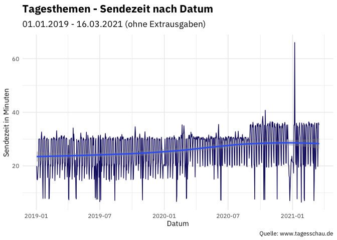
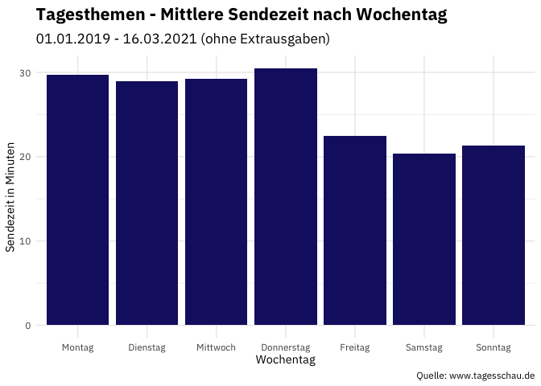

Einleitung und Fragstellungen
-----------------------------

Im vorigen Post habe ich beschrieben, wie ich die Daten, die nun
analysiert werden, gewonnen habe.

Explorative Datenanalyse
------------------------

### Einlesen der Rohdaten & Sanity Checks

Dieser Schritt ist sehr einfach; als erstes werden die gescrapten
Rohdaten mit den Informationen zur Sendung eingelesen und anschließend
die Zuordnung der Moderator\*innen zu den Sendungen. Im Folgeschritt
werden beide über den Namen des Bildes (der eineindeutig ist)
zusammengeführt

    library(tidyverse)

    tagesthemen <- read_csv("scraped_data.csv")

    ## 
    ## ── Column specification ─────────────────────────────────────────────────────────────────────────────────────────────────────────────────────
    ## cols(
    ##   datum_zeit = col_datetime(format = ""),
    ##   dauer = col_double(),
    ##   themen = col_character(),
    ##   standbild_url = col_character(),
    ##   url = col_character()
    ## )

    moderatoren <- read_csv("moderatoren_sendung.csv")

    ## 
    ## ── Column specification ─────────────────────────────────────────────────────────────────────────────────────────────────────────────────────
    ## cols(
    ##   file = col_character(),
    ##   name = col_character()
    ## )

    tagesthemen <- tagesthemen %>% 
      mutate(dauer = as.numeric(dauer),
             date = as.Date(strftime(datum_zeit, format = "%Y-%m-%d")),
             dateiname_standbild = str_remove(standbild_url, "https://www.tagesschau.de/multimedia/bilder/")) %>% 
      left_join(moderatoren, by = c("dateiname_standbild" = "file"))

    rm(moderatoren)

Zunächst wird die Vollständigkeit der Daten untersucht. Das mache ich
gerne mit der Funktion “skim” aus dem Paket “skimr”, weil der Output
einen guten Überblick gibt.

    library(skimr)

    tagesthemen %>% 
      skim()

<table>
<caption>Data summary</caption>
<tbody>
<tr class="odd">
<td style="text-align: left;">Name</td>
<td style="text-align: left;">Piped data</td>
</tr>
<tr class="even">
<td style="text-align: left;">Number of rows</td>
<td style="text-align: left;">813</td>
</tr>
<tr class="odd">
<td style="text-align: left;">Number of columns</td>
<td style="text-align: left;">8</td>
</tr>
<tr class="even">
<td style="text-align: left;">_______________________</td>
<td style="text-align: left;"></td>
</tr>
<tr class="odd">
<td style="text-align: left;">Column type frequency:</td>
<td style="text-align: left;"></td>
</tr>
<tr class="even">
<td style="text-align: left;">character</td>
<td style="text-align: left;">5</td>
</tr>
<tr class="odd">
<td style="text-align: left;">Date</td>
<td style="text-align: left;">1</td>
</tr>
<tr class="even">
<td style="text-align: left;">numeric</td>
<td style="text-align: left;">1</td>
</tr>
<tr class="odd">
<td style="text-align: left;">POSIXct</td>
<td style="text-align: left;">1</td>
</tr>
<tr class="even">
<td style="text-align: left;">________________________</td>
<td style="text-align: left;"></td>
</tr>
<tr class="odd">
<td style="text-align: left;">Group variables</td>
<td style="text-align: left;">None</td>
</tr>
</tbody>
</table>

**Variable type: character**

<table>
<thead>
<tr class="header">
<th style="text-align: left;">skim_variable</th>
<th style="text-align: right;">n_missing</th>
<th style="text-align: right;">complete_rate</th>
<th style="text-align: right;">min</th>
<th style="text-align: right;">max</th>
<th style="text-align: right;">empty</th>
<th style="text-align: right;">n_unique</th>
<th style="text-align: right;">whitespace</th>
</tr>
</thead>
<tbody>
<tr class="odd">
<td style="text-align: left;">themen</td>
<td style="text-align: right;">0</td>
<td style="text-align: right;">1.00</td>
<td style="text-align: right;">169</td>
<td style="text-align: right;">1196</td>
<td style="text-align: right;">0</td>
<td style="text-align: right;">813</td>
<td style="text-align: right;">0</td>
</tr>
<tr class="even">
<td style="text-align: left;">standbild_url</td>
<td style="text-align: right;">0</td>
<td style="text-align: right;">1.00</td>
<td style="text-align: right;">27</td>
<td style="text-align: right;">87</td>
<td style="text-align: right;">0</td>
<td style="text-align: right;">810</td>
<td style="text-align: right;">0</td>
</tr>
<tr class="odd">
<td style="text-align: left;">url</td>
<td style="text-align: right;">0</td>
<td style="text-align: right;">1.00</td>
<td style="text-align: right;">57</td>
<td style="text-align: right;">57</td>
<td style="text-align: right;">0</td>
<td style="text-align: right;">813</td>
<td style="text-align: right;">0</td>
</tr>
<tr class="even">
<td style="text-align: left;">dateiname_standbild</td>
<td style="text-align: right;">0</td>
<td style="text-align: right;">1.00</td>
<td style="text-align: right;">27</td>
<td style="text-align: right;">64</td>
<td style="text-align: right;">0</td>
<td style="text-align: right;">810</td>
<td style="text-align: right;">0</td>
</tr>
<tr class="odd">
<td style="text-align: left;">name</td>
<td style="text-align: right;">7</td>
<td style="text-align: right;">0.99</td>
<td style="text-align: right;">10</td>
<td style="text-align: right;">14</td>
<td style="text-align: right;">0</td>
<td style="text-align: right;">4</td>
<td style="text-align: right;">0</td>
</tr>
</tbody>
</table>

**Variable type: Date**

<table>
<thead>
<tr class="header">
<th style="text-align: left;">skim_variable</th>
<th style="text-align: right;">n_missing</th>
<th style="text-align: right;">complete_rate</th>
<th style="text-align: left;">min</th>
<th style="text-align: left;">max</th>
<th style="text-align: left;">median</th>
<th style="text-align: right;">n_unique</th>
</tr>
</thead>
<tbody>
<tr class="odd">
<td style="text-align: left;">date</td>
<td style="text-align: right;">0</td>
<td style="text-align: right;">1</td>
<td style="text-align: left;">2019-01-02</td>
<td style="text-align: left;">2021-03-17</td>
<td style="text-align: left;">2020-02-03</td>
<td style="text-align: right;">679</td>
</tr>
</tbody>
</table>

**Variable type: numeric**

<table>
<thead>
<tr class="header">
<th style="text-align: left;">skim_variable</th>
<th style="text-align: right;">n_missing</th>
<th style="text-align: right;">complete_rate</th>
<th style="text-align: right;">mean</th>
<th style="text-align: right;">sd</th>
<th style="text-align: right;">p0</th>
<th style="text-align: right;">p25</th>
<th style="text-align: right;">p50</th>
<th style="text-align: right;">p75</th>
<th style="text-align: right;">p100</th>
<th style="text-align: left;">hist</th>
</tr>
</thead>
<tbody>
<tr class="odd">
<td style="text-align: left;">dauer</td>
<td style="text-align: right;">0</td>
<td style="text-align: right;">1</td>
<td style="text-align: right;">1543.83</td>
<td style="text-align: right;">457.58</td>
<td style="text-align: right;">347</td>
<td style="text-align: right;">1213</td>
<td style="text-align: right;">1786</td>
<td style="text-align: right;">1836</td>
<td style="text-align: right;">3962</td>
<td style="text-align: left;">▂▇▇▁▁</td>
</tr>
</tbody>
</table>

**Variable type: POSIXct**

<table>
<thead>
<tr class="header">
<th style="text-align: left;">skim_variable</th>
<th style="text-align: right;">n_missing</th>
<th style="text-align: right;">complete_rate</th>
<th style="text-align: left;">min</th>
<th style="text-align: left;">max</th>
<th style="text-align: left;">median</th>
<th style="text-align: right;">n_unique</th>
</tr>
</thead>
<tbody>
<tr class="odd">
<td style="text-align: left;">datum_zeit</td>
<td style="text-align: right;">0</td>
<td style="text-align: right;">1</td>
<td style="text-align: left;">2019-01-01 23:15:00</td>
<td style="text-align: left;">2021-03-17 22:15:00</td>
<td style="text-align: left;">2020-02-03 22:15:00</td>
<td style="text-align: right;">813</td>
</tr>
</tbody>
</table>

Mit Ausnahme von 6 Missings in der Variablen “name” sieht die
Vollständigkeit schon mal gut aus. Aber was ist bei der Variable los?
Dazu filtere ich einmal die Missings an und schaue mir die Beobachtungen
genauer an.

    view( 
      tagesthemen %>% 
      filter(is.na(name)))

OK, es wird klarer: 4 der 6 Sendungen haben kein Vorschaubild;
entsprechend kann die moderierende Person nur erkannt werden, in dem das
Video analysiert/angeschaut wird.  
Normalerweise wäre das der Zeitpunkt, an dem man sich Gedanken machen
müsste, wie man die Ableitung noch sicherer machen könnte, im Sinne von
unabhängiger vom Vorschaubild.

Und hier ist er nun, der erste Scheideweg an dem man sich die Frage
stellen muss, wie man weiter vorgeht. Es gibt meiner Meinung nach vier
Optionen.

Option 1 (keinesfalls best practise): Man schaut sich die Videos an und
hard-coded den Namen der moderierenden Person. Aber nehmen wir mal an,
wir hätten z.B. 40 Missings - dann wäre das schon aufwändig. Im Bereich
Big Data hat man aber gelegentlich deutlich mehr missings, dann ist das
nicht nur aufwändig sondern schlichtweg nicht mehr leistbar.

Option 2 (finde ich persönlich zu einfach gedacht; findet man aber
häufig): Die Beobachtungen werden gelöscht.

Option 3: Man ergänzt die Missings durch einen Platzhalter “Name nicht
bekannt”.

Option 4 (dafür entscheide ich mich): Die Daten werden aufgefüllt. Hier
kann man von einfacher (z.B. “Interpolation”, KNN) bis sehr
sophisticated (z.B. Random Forrest) herangehen. Ich entscheide mich im
Folgenden für den einfacheren Weg, da der Datensatz für anspruchsvollere
Ansätze noch zu wenig features aufweist.

    tagesthemen <- tagesthemen %>% 
      arrange(datum_zeit) %>% 
      fill(name, .direction = "up")

    view(tagesthemen)

Ein Blick auf den dataframe zeigt, dass noch das eine oder andere zu tun
ist:

-   Die Variable “Zeit” sollte gesplittet werden in “Datum” und
    “Uhrzeit”
-   Die Sendedauer ist noch in Sekdungen enthalten und sollte
    umgerechnet werden, da wir uns eher 5 Minuten als 300 Sekunden
    vorstellen können
-   Die Variable mit den Themen der Sendung muss noch optimiert werden;
    das wird aber später gemacht, wenn es um die Textanalyse geht.

<!-- -->

    tagesthemen <- tagesthemen %>% 
      mutate(date = as.Date(datum_zeit, format = "%Y-%m-%d"),
             time = format(datum_zeit, "%H:%M:%S"),
             dauer = dauer / 60)

Nun sind die Voraussetzungen geschaffen, sich tiefer in die Daten
einzugraben.

    min(tagesthemen$time)

    ## [1] "21:00:00"

Die frühestes Sende-Uhrzeit einer Ausgabe der Tagestehmen ist um 21 Uhr.
Hier kommt nun “Domain Expertise” ins Spiel und die sagt: es ist
ungewöhnlich, dass eine Ausgabe der Tagesthemen bereits 1 Stunde nach
der Tagesschau gesendet wird.

    tagesthemen %>% 
      filter(time <= "21:00:00")

    ## # A tibble: 2 x 9
    ##   datum_zeit          dauer themen                      standbild_url             url            date       dateiname_standbild  name   time 
    ##   <dttm>              <dbl> <chr>                       <chr>                     <chr>          <date>     <chr>                <chr>  <chr>
    ## 1 2019-05-18 21:00:00  8.05 "\n                       … https://www.tagesschau.d… https://www.t… 2019-05-18 sendungsbild-488417… Pinar… 21:0…
    ## 2 2020-01-19 21:00:00  7.73 "\n                       … https://www.tagesschau.d… https://www.t… 2020-01-19 sendungsbild-560479… Ingo … 21:0…

Es existieren genau zwei Sendungen, die vor oder um 21 Uhr ausgestrahlt
wurden. Auffällig ist, dass diese sehr kurz waren (maximal 8 Minuten).
Ein Blick auf ein paar der Sendungen zeigt, es handelte sich um
Extra-Ausgaben. Das heißt, es muss nun identifiziert werden, welche der
Sendungen in dem Datensatz eine reguläre und welche eine Extra Ausgabe
ist.

    tagesthemen %>% 
      group_by(date) %>% 
      arrange(datum_zeit) %>% 
      summarize(anzahl_sendungen = n()) %>% 
      count(anzahl_sendungen)

    ## # A tibble: 2 x 2
    ##   anzahl_sendungen     n
    ##              <int> <int>
    ## 1                1   779
    ## 2                2    17

Zunächst: es gibt maximal 17 Tage, an denen zwei Sendungen vorhanden
waren. Das heißt die kürzere der beiden Sendungen wird nun als
Extra-Ausgabe markiert.

    tagesthemen <- tagesthemen %>% 
      arrange(datum_zeit) %>% 
      group_by(date) %>% 
      mutate(extra = if_else(dauer == max(dauer),0,1))

    tagesthemen %>% 
      ungroup() %>% 
      filter(extra == 0) %>%
      ggplot(aes(x=datum_zeit, y=dauer)) +
      theme_plex() +
      geom_line(color = "midnightblue") +
      geom_smooth() +
      labs(x = "Datum", y = "Sendezeit in Minuten", caption = "Quelle: www.tagesschau.de", 
           subtitle = "01.01.2019 - 16.03.2021 (ohne Extrausgaben) ", title = "Tagesthemen - Sendezeit nach Datum")

    ## `geom_smooth()` using method = 'loess' and formula 'y ~ x'

Das erste Ergebnis - und schon so interessant!

Zunächst ist starkes “Zucken” in den Daten erkennbar; in jeder Woche
gibt es starke Schwankungen. Daher ist es natürlich sinnvoll, die Werte
auch noch einmal nach Wochentagen anzuschauen. Das passiert gleich.

Weiterhin ist erkennbar, dass ab ca. August 2020 eine kleine Treppe in
der durchschnittlichen Sendezeit erkennbar ist. Das ist kein Fehler
sondern hat nach meiner Recherche einen einfachen Grund: es wurde eine
neue Serie in den Tagesthemen etabliert, namens “mittendrin”. Mehr dazu
in diesem Video:
<a href="https://youtu.be/m6AGY1hB65o" class="uri">https://youtu.be/m6AGY1hB65o</a>

Und natürlich fällt ein starker Extremwert ins Auge undzwar gleich zu
Beginn des Jahres 2021. Hierbei handelt es sich um die Sendung vom 06.
Januar 2021 als in den USA das Kongressgebäude gestürmt wurde.

Jetzt zu den Wochentagen. Für diese Analyse muss zunächst die Variable
des Wochentages gebildet werden, um anschließend danach auswerten zu
können. Damit in den Plots die Reihenfolge der Wochentage stimmt, wird
die Reihenfolge der Faktor-Level explizit definiert.

    tagesthemen <- tagesthemen %>% 
      mutate(day = factor(weekdays(datum_zeit), levels = c("Montag", "Dienstag", "Mittwoch",
                                                           "Donnerstag","Freitag","Samstag","Sonntag"))) 

Und nun der Plot.

    tagesthemen %>% 
      filter(extra == 0) %>% 
      group_by(day) %>% 
      summarise(mittlere_sendezeit = mean(dauer)) %>% 
      ggplot(aes(x = day, y = mittlere_sendezeit)) +
      geom_bar(stat = "identity", fill = "midnightblue") +
      labs(x = "Wochentag", y = "Sendezeit in Minuten", caption = "Quelle: www.tagesschau.de", 
           subtitle = "01.01.2019 - 16.03.2021 (ohne Extrausgaben) ", title = "Tagesthemen - Mittlere Sendezeit nach Wochentag") + 
      theme_plex()

Das die Tagesthemen am Wochenende kürzer sind, das wusste ich. Neu war
mir, dass dies offensichtlich schon am Freitag der Fall ist. Erkennbar
ist, das an den Tagen von Montag bis Donnerstag eine Sendung im
Durchschnitt 28-30 Minuten dauert und von Freitag bis Sonntag knapp über
20 Minuten. Das ist doch gut zu wissen, wenn man mal wieder dringend
aufs Klo muss, aber den nächsen Beitrag nicht verpassen möchte ;-)

Mit diesen ersten Einblicken endet dieser Post zunächst.

In den nächsten Posts gehe ich auf die Suche nach weiteren Insights -
stay tuned!
