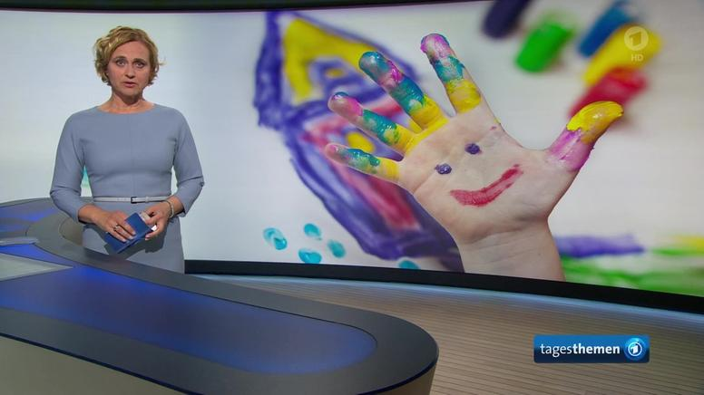

## Tagesthemen

Ich schaffe es selten um 20 Uhr vor dem Fernseher zu sein und mir die Tagesschau anzuschauen.
Aber das ist nicht der Hauptgrund, denn es ist ja möglich, die Tagesschau nach der Ausstrahlung jederzeit und überall zu schauen.
Aber spannender finde ich dennoch die Tagesthemen, weil hier noch detailierter berichetet wird.



```{r cars}
summary(cars)
```

## Including Plots

You can also embed plots, for example:

```{r pressure, echo=FALSE}
plot(pressure)
```

Note that the `echo = FALSE` parameter was added to the code chunk to prevent printing of the R code that generated the plot.
